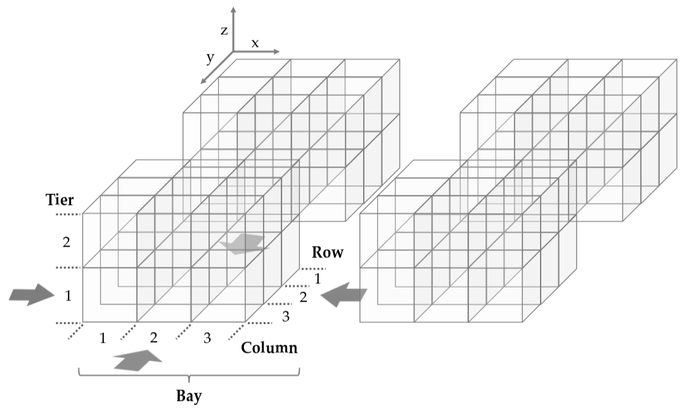

The UPMP focuses on reorganizing unit loads within a block-stacking warehouse to eliminate retrieval blockages. A block-stacking warehouse consists of a 3D grid of storage locations (columns, rows, and tiers) where unit loads are stacked without additional infrastructure.

### Bay Layout

During pre-marshalling, no new unit loads enter or leave the warehouse. A unit load is blocking if it obstructs access to a higher-priority load, where priorities are typically assigned based on retrieval urgency.

This study particularly focuses on a simplified UPMP scenario with:

- A single access direction This makes the problem especially challenging due to the restricted movement possibilities within the layout.
